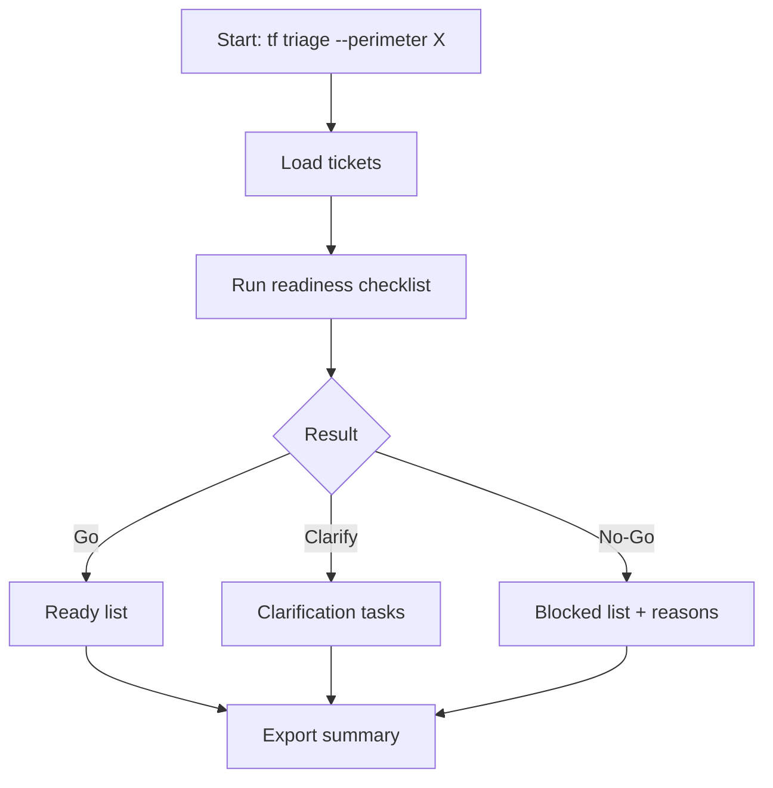
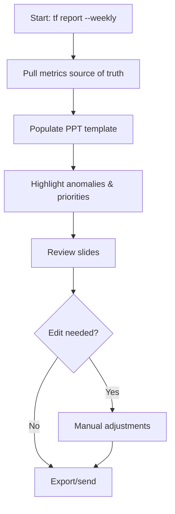
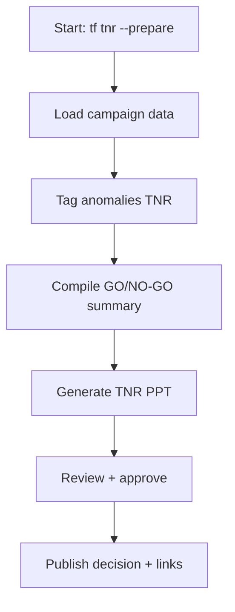
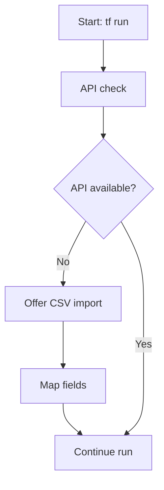
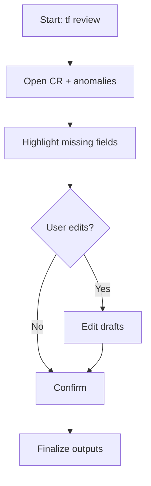
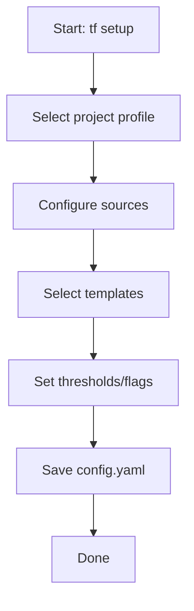
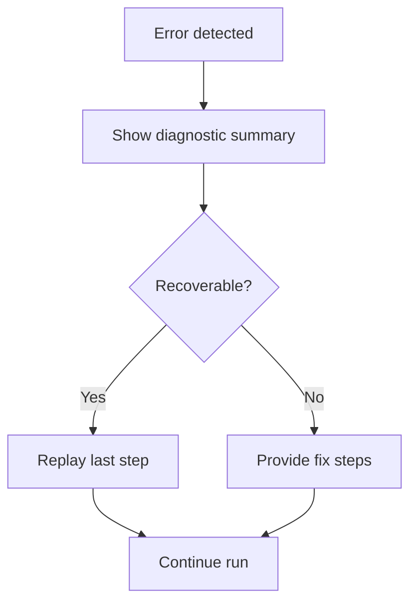
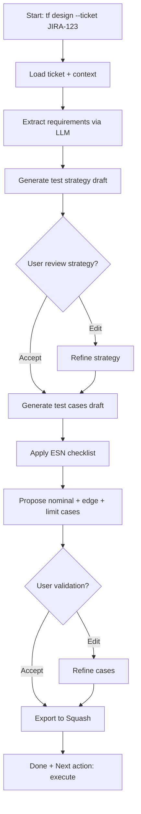

---
stepsCompleted:
  - 'step-01-init'
  - 'step-02-discovery'
  - 'step-03-core-experience'
  - 'step-04-emotional-response'
  - 'step-05-inspiration'
  - 'step-06-design-system'
  - 'step-07-defining-experience'
  - 'step-08-visual-foundation'
  - 'step-09-design-directions'
  - 'step-10-user-journeys'
  - 'step-11-component-strategy'
  - 'step-12-ux-patterns'
  - 'step-13-responsive-accessibility'
  - 'step-14-complete'
  - 'validation-review'
lastStep: 14
version: '1.1'
validationDate: '2026-01-30'
validationStatus: 'APPROVED_WITH_CORRECTIONS'
inputDocuments:
  - '_bmad-output/prd/qa-tester-process-optimization-brief-client.md'
  - '_bmad-output/prd/qa-tester-process-optimization-prd.md'
  - '_bmad-output/planning-artifacts/prd-validation.md'
  - '_bmad-output/planning-artifacts/prd.md'
---

# UX Design Specification QA Tester Process Optimization (TRA)

**Author:** Edouard
**Date:** 2026-01-30

---

<!-- UX design content will be appended sequentially through collaborative workflow steps -->
## Executive Summary

### Project Vision

Créer une interface unique et fiable qui permet au testeur QA de couvrir environ 80% de ses actions quotidiennes sans changer d’outils, en réduisant la charge mentale et le temps passé sur le reporting et la préparation.

### Target Users

- Utilisateur principal : QA Tester (TRA), niveau CLI novice à intermédiaire.
- Parties prenantes : CP, MOA, QA Lead / Pilot, qui valident la stratégie, consomment les rapports et suivent la qualité.

### Key Design Challenges

- Réduire les transferts manuels entre Jira/Squash/Excel/PPT tout en garantissant la fiabilité des données, sans perturber les outils existants.
- Concevoir une UX CLI claire et guidée pour des profils novices à intermédiaires, compatible avec un usage tout au long de la journée.
- Assurer une traçabilité simple et fiable des preuves, anomalies et rapports.
- Tenir le SLA : pré-remplissage automatique < 2 min, CR prêt à envoyer < 5 min après le run (relecture incluse).
- Sorties strictement conformes aux templates existants (CR/PPT/anomalies), sans personnalisation visuelle.

### Design Opportunities

- Unifier 80% du travail quotidien via une seule interface, en mode “assistant”.
- Proposer un flux guidé et rassurant pour standardiser checklist, anomalies, et reporting.
- Faire gagner du temps via des pré-remplissages intelligents et des templates prêts à l’emploi.

## Core User Experience

### Defining Experience

Le cœur de l’expérience est un “run” unique et guidé qui récupère les données Jira/Squash/Excel, applique la checklist, et génère un CR quotidien pré‑rempli ainsi que les éléments d’anomalies. L’utilisateur n’a plus qu’à relire et ajuster rapidement.

### Platform Strategy

UX CLI uniquement, avec un mode interactif guidé et un mode batch pour les usages récurrents. Prévoir un mode dégradé lorsque les APIs ne sont pas disponibles (fallback via imports/exports CSV).

### Effortless Interactions

- Pré‑remplissage automatique des templates (CR, anomalies).
- Checklist de testabilité simple avec score instantané Go/Clarify/No‑Go.
- Liaison automatique preuves ↔ tickets ↔ anomalies.

### Critical Success Moments

- Pré-remplissage automatique du CR < 2 minutes (partie système).
- Le CR est généré et prêt en moins de 5 minutes, avec un haut niveau de confiance.
- Un ticket passe clairement “ready” ou “à clarifier” dès le triage.

### Experience Principles

- **Un run = un résultat** : une action simple qui prépare 80% du travail quotidien.
- **Guidé et rassurant** : l’UX CLI élimine les doutes avec un flux clair.
- **Zéro double saisie** : la donnée circule automatiquement entre sources et livrables.
- **Fiabilité visible** : l’utilisateur voit ce qui vient d’où, et peut valider rapidement.

## Desired Emotional Response

### Primary Emotional Goals

L’outil doit faire ressentir au testeur : **soulagement**, **contrôle**, **confiance** et **efficacité**.  
L’efficacité est l’émotion clé qui déclenche la recommandation à un collègue.

### Emotional Journey Mapping

- **Premier contact** : rassuré, car tout est clair et simple.
- **Pendant le run** : en contrôle, grâce à une progression visible.
- **Après la tâche** : soulagé et efficace, avec un gain de temps évident.
- **En cas d’erreur** : calme et guidé, avec des solutions immédiates.

### Micro-Emotions

- **Confiance** (plutôt que confusion)
- **Calme** (plutôt que anxiété)
- **Fierté d’accomplissement** (plutôt que frustration)
- **Satisfaction** (plutôt que doute)

### Design Implications

- Transparence sur l’état et les sources → renforce la confiance.
- Progression claire et feedback continus → maintient le contrôle.
- Résultats rapides et visibles → amplifient le soulagement et l’efficacité.
- Messages d’erreur actionnables → évitent l’anxiété.

### Emotional Design Principles

- **Clarté avant tout** : réduire l’incertitude à chaque étape.
- **Contrôle visible** : toujours montrer “où on en est”.
- **Efficacité perceptible** : gains de temps concrets, immédiatement visibles.
- **Assistance calme** : guider sans culpabiliser.

## UX Pattern Analysis & Inspiration

### Inspiring Products Analysis

- **Claude Code** : guidance pas à pas et ton rassurant → confiance et sentiment de contrôle.
- **Codex** : intentions simples → exécution rapide, feedback clair, erreurs pragmatiques.
- **GitHub CLI / Stripe CLI** : syntaxe prévisible, help contextuel, messages concis → flux “happy path” très fluide.
- **lazygit / fzf** : vitesse, recherche instantanée, actions contextualisées → efficacité perçue.
- **Notion / Airtable / Google Sheets** : modèles réutilisables et structure claire → standardisation et gain de temps.
- **Linear / Jira (bien configuré)** : champs structurés, priorités visibles → triage rapide et décision claire.

### Transferable UX Patterns

- **Navigation** : commandes simples + sous-commandes prévisibles, avec aide contextuelle.
- **Interaction** : “next best action” explicite après chaque étape.
- **Feedback** : retour immédiat, concis, orienté résultat.
- **Templates** : modèles prêts à l’emploi pour CR/anomalies.
- **Recherche** : filtres rapides et sélection assistée (à la fzf).

### Anti-Patterns to Avoid

- Surcharge d’options dès le départ (trop de flags, trop de choix).
- Logs verbeux qui masquent l’état réel.
- Messages d’erreur vagues qui n’indiquent pas quoi faire.
- Obliger l’utilisateur à re-saisir des données déjà connues.

### Design Inspiration Strategy

**À adopter**
- Guidance pas à pas et “next action” (Claude Code).
- Feedback court et actionnable (Codex, Stripe CLI).
- Templates de travail prêts à l’emploi (Notion/Airtable).

**À adapter**
- Recherche rapide type fzf pour sélectionner tickets/lot.
- Modèle de triage structuré comme Linear/Jira, mais simplifié.

**À éviter**
- Complexité initiale et surcharge d’options.
- Verbosité non utile et erreurs non actionnables.

## Design System Foundation

### 1.1 Design System Choice

**Approche : Système d’interaction CLI sur mesure, basé sur des patterns établis**  
Un système “custom léger” : commandes et feedbacks uniques, mais inspirés des meilleures pratiques CLI (aide contextuelle, messages concis, guidance pas à pas).

### Rationale for Selection

- **Unicité + équilibre** : identité propre sans sur-investir dans un design visuel lourd.
- **Aucune charte existante** : liberté pour définir des patterns simples et cohérents.
- **Niveau UX faible** : s’appuyer sur des patterns éprouvés pour éviter les pièges.
- **Pas de deadline** : possibilité d’affiner progressivement.

### Implementation Approach

- Définir un “pattern book” CLI : structure de commande, réponses, erreurs, confirmations, progression.
- Standardiser les messages (succès, warning, erreur) et la hiérarchie des infos.
- Documenter les flows essentiels : run quotidien, triage, anomalies, reporting.

### Customization Strategy

- Ton et wording rassurants, cohérents avec l’émotion cible (contrôle, efficacité).
- Templates de sortie ajustables (CR/anomalies).
- Variables de configuration pour adapter les comportements (profil, verbose, dry-run).

## 2. Core User Experience

### 2.1 Defining Experience

L’expérience signature, c’est un **run unique** qui collecte Jira/Squash/Excel, applique la checklist, puis génère un CR quotidien et des brouillons d’anomalies prêts à relire. L’utilisateur résume l’outil ainsi : “je lance, je relis, j’envoie”.

### 2.2 User Mental Model

Aujourd’hui, le testeur jongle entre plusieurs outils, fait des exports manuels, nettoie, met en forme, puis envoie. Son modèle mental est “assembler des éléments dispersés” et “copier-coller pour produire le reporting”.

### 2.3 Success Criteria

- Pre-remplissage automatique du CR < 2 minutes (partie systeme).
- CR prêt en < 5 minutes après le run (relecture/ajustements inclus).
- Checklist appliquée et explicite (Go/Clarify/No-Go).
- Zéro re-saisie des données déjà présentes.
- Résultats jugés fiables et exploitables dès la première relecture.

### 2.4 Novel UX Patterns

Le cœur reste **familier** (CLI + commandes guidées), avec une innovation légère : un run unique qui orchestre tout et propose la “next best action”. Pas de pattern radicalement nouveau, mais une combinaison fluide et rassurante.

### 2.5 Experience Mechanics

**1. Initiation**  
Commande simple (`run` ou alias), avec un prompt clair et des options minimales.

**2. Interaction**  
Le système collecte les sources, applique la checklist, prépare CR/anomalies, et affiche la progression.

**3. Feedback**  
Messages courts, état visible, et recommandations d’action (corriger, valider, envoyer).

**4. Completion**  
Sorties prêtes à usage (CR, anomalies) + récapitulatif des actions effectuées.

## Visual Design Foundation

*Note : ces fondations visuelles s'appliquent aux sorties basées sur templates existants (CR/PPT/anomalies) et a la documentation, sans personnalisation visuelle hors template.*

### Color System

**Thème : Pro-Calme (bleu/gris)**  
Palette de base orientée confiance et calme, avec une accentuation claire des états.

- **Primary** : bleu profond (confiance, stabilité)
- **Neutrals** : gris neutres clairs/foncés pour hiérarchie lisible
- **Success** : vert doux (validation, “tout est OK”)
- **Warning** : ambre discret (attention sans stress)
- **Error** : rouge contrôlé (clarté sans agressivité)

### Typography System

**Pairing recommandé : IBM Plex**  
- **Monospace (CLI / outputs)** : IBM Plex Mono  
- **Sans (docs / reporting)** : IBM Plex Sans  
Hiérarchie simple, lisible, professionnelle, avec un ton sobre.

### Spacing & Layout Foundation

- **Densité respirée** : lignes et blocs bien séparés pour éviter la fatigue cognitive.
- **Base spacing** : échelle 8px (ou équivalent dans le rendu doc).
- **Hiérarchie claire** : titres, sections, listes, et états facilement repérables.

### Accessibility Considerations

- Contrastes élevés pour lisibilité en terminal et dans la doc.
- Couleurs d’état doublées par libellés explicites (pas de dépendance au seul code couleur).
- Taille de texte confortable pour lecture prolongée.

## Design Direction Decision

### Design Directions Explored

- Guided Run (calme, progression claire)
- Split View (contrôle + preuves visibles)
- Minimal Batch (vitesse maximale)
- Template Studio (structure et templates)
- KPI Snapshot (confiance via indicateurs)
- Gentle Coach (guidé, rassurant)

### Chosen Direction

**Direction 1: Guided Run (Calm Focus)**  
Une interface centrée sur un run guidé, avec progression visible, feedback concis, et “next action” explicite.

### Design Rationale

- Alignement direct avec les émotions cibles : contrôle, confiance, soulagement, efficacité.
- Favorise un “happy path” clair et réduit la charge mentale.
- Compatible avec utilisateurs CLI novices à intermédiaires.
- S’inscrit dans le pattern “run unique” défini comme interaction signature.

### Implementation Approach

- Pipeline de run en 4 étapes (collecte → checklist → génération → review).
- États visibles + feedback court (OK/Warn/Error).
- “Next action” systématique en fin de run (ex: review, send, export).

## User Journey Flows

### 1) Run quotidien complet (collecte → checklist → CR → review)
```mermaid
flowchart TD
  A[Start: tf run --daily] --> B[Collect sources Jira/Squash/Excel]
  B --> C{Sources OK?}
  C -- No --> C1[Mode dégradé proposé (CSV/import)] --> B
  C -- Yes --> D[Apply checklist Go/Clarify/No-Go]
  D --> E[Generate CR draft + anomaly drafts]
  E --> F[Review summary]
  F --> G{User edits?}
  G -- Yes --> H[Open review/edit]
  G -- No --> I[Export/send]
  H --> I[Export/send]
  I --> J[Done + Next action suggestion]
```

### 2) Triage & readiness (Go / Clarify / No-Go)


### 3) Gestion d’anomalies (draft → standardisation → lien preuves)
```mermaid
flowchart TD
  A[Start: tf anomalies --draft] --> B[Select test cases]
  B --> C[Generate anomaly draft]
  C --> D[Apply template fields]
  D --> E[Link evidence (SharePoint)]
  E --> F[Link Jira + Squash]
  F --> G[Review & confirm]
  G --> H[Publish anomalies]
```

### 4) Reporting hebdo (PPT) + synthèse


### 5) TNR / GO-NO-GO


### 6) Mode dégradé (APIs indisponibles → import CSV → run)


### 7) Relecture & validation (review des drafts → validation finale)


### 8) Configuration projet (templates, profils, sources)


### 9) Récupération d'erreur / replay (diagnostic → relance)


### 10) Conception assistée (Test Design Assistance)


**Couvre FR6-FR9 du PRD :**
- FR6 : Génération brouillon stratégie de test
- FR7 : Propositions de cas de test (nominaux, variantes, limites)
- FR8 : Édition et validation avant publication
- FR9 : Intégration checklist ESN

### Journey Patterns

- **Pattern “Run + Next Action”** : chaque flow se termine par une action recommandée.
- **Pattern “Check → Generate → Review”** : logique standard de qualité.
- **Pattern “Fallback Graceful”** : dégradé via CSV/import quand APIs indisponibles.

### Flow Optimization Principles

- Réduire la saisie manuelle (zéro double saisie).
- Afficher l’état et la progression à chaque étape.
- Erreurs actionnables avec proposition de recovery.

## Component Strategy

### Design System Components

Système d’interaction CLI “custom léger” basé sur patterns éprouvés :
- Command prompt + help contextuel
- Progress indicator (étapes + %)
- Status line (OK / WARN / ERROR)
- Summary block (résumé des actions)
- Next-action suggestion

### Custom Components

#### Run Pipeline Summary
**Purpose:** synthèse du run (collecte → checklist → génération → review)
**States:** running / success / warning / error / degraded
**Interaction:** affiche la prochaine action
**Degraded Mode Display:**
- Indicateur visuel `[DEGRADED]` en orange si une source est en fallback CSV
- Liste des sources OK vs fallback (ex: `Jira: OK | Squash: CSV fallback`)
- Message explicite : "Mode dégradé actif – certaines données proviennent d'imports manuels"

#### Checklist Result Panel
**Purpose:** Go/Clarify/No-Go + raisons  
**States:** success / warning / error  
**Variants:** par périmètre / lot

#### Anomaly Draft Template
**Purpose:** standardiser les anomalies  
**Content:** contexte, repro, preuve, impact  
**Interaction:** validation avant publication

#### Evidence Linker
**Purpose:** lier preuves SharePoint ↔ tickets  
**States:** linked / missing / error  
**Interaction:** propose correction si lien manquant

#### Report Output Preview
**Purpose:** aperçu CR/PPT avant export  
**Interaction:** quick review + edit

#### Ticket Picker
**Purpose:** sélection rapide par périmètre/lot  
**Interaction:** recherche instantanée type fzf

#### Diff/Delta Viewer
**Purpose:** afficher ce qui a changé depuis la dernière exécution  
**Interaction:** focus sur écarts clés

#### Error Recovery Card
**Purpose:** diagnostic + action recommandée  
**States:** recoverable / blocked

#### Config Validator
**Purpose:** vérifier sources/credentials avant run  
**Interaction:** liste de checks + statut

#### Export Router
**Purpose:** choix rapide format + destination  
**Variants:** md/csv/ppt + SharePoint/Outlook/local

#### Dry-Run Preview
**Purpose:** simuler les actions avant exécution
**Interaction:** affiche l'impact sans modification

#### Privacy & LLM Mode Indicator
**Purpose:** afficher le mode de traitement IA et le niveau de confidentialité actif
**States:** local / cloud-anonymized / disabled
**Display:**
- `[LLM: LOCAL]` en vert – traitement 100% local
- `[LLM: CLOUD ✓]` en bleu – cloud avec anonymisation active
- `[LLM: OFF]` en gris – mode sans IA
**Interaction:** visible dans la status line pendant les opérations IA
**Couvre FR28-FR31 du PRD :**
- FR28 : Anonymisation automatique visible
- FR29 : Mode LLM local clairement identifié
- FR30 : Journalisation sans données sensibles (implicite)
- FR31 : Gestion secrets (configuration, pas UX directe)

#### Test Design Assistant Panel
**Purpose:** guider la conception de cas de test assistée par IA
**States:** loading / draft-ready / validated / exported
**Content:** stratégie de test, cas nominaux, variantes, limites
**Interaction:** édition inline + validation avant export Squash
**Couvre FR6-FR9 du PRD**

### Component Implementation Strategy

- Standardiser tous les composants avec les mêmes patterns d’état.
- Messages courts et actionnables, cohérents avec le ton “calme/pro”.
- Utiliser les tokens de la fondation visuelle (couleurs états + typo).

### Implementation Roadmap

**Phase 1 (core)**
- Run Pipeline Summary (avec mode dégradé), Checklist Result Panel, Summary block, Next-action suggestion.
- Privacy & LLM Mode Indicator (visible dès le premier run).

**Phase 2 (ops)**
- Evidence Linker, Anomaly Draft Template, Report Output Preview.
- Test Design Assistant Panel (conception assistée FR6-FR9).

**Phase 3 (power)**
- Ticket Picker, Diff/Delta Viewer, Error Recovery Card, Export Router, Dry-Run Preview, Config Validator.

## UX Consistency Patterns

### Button Hierarchy (CLI Actions)

- **Primary action** : commande directe (ex: `tf run`)
- **Secondary action** : option explicite (ex: `--review`, `--export`)
- **Confirmation** : uniquement pour actions irréversibles (ex: `--publish`)
- **Default** : toujours visible et sûr (no destructive by default)

### Feedback Patterns

- **Success** : message court + résultat (OK)
- **Warning** : cause + action recommandée
- **Error** : diagnostic + “next best action”
- **Info** : état ou progression sans bruit

### Form Patterns (Prompts & Inputs)

- Prompts courts, un par ligne
- Valeurs par défaut visibles
- Champs requis explicités
- Validation immédiate avec message correctif

### Navigation Patterns

- Commandes hiérarchiques : `tf <module> <action>`
- Help contextuel : `tf <module> --help`
- “Next action” proposé en fin de flow

### Search & Filtering Patterns

- Sélection rapide type fzf
- Filtres par périmètre / lot / statut
- Résumé de sélection avant exécution

### Additional Patterns

**Empty States & Loading**  
- État vide explicite + action possible  
- Chargement : étapes visibles et durée estimée

**Errors & Recovery**  
- Diagnostic en 2 lignes max  
- Option de replay  
- Mode dégradé proposé si API indisponibles

## Responsive Design & Accessibility

### Responsive Strategy

- **Desktop-first** : usage principal sur poste de travail (terminal).
- **Mobile/tablette hors scope** pour l’interface CLI.
- Pour la doc/outputs web, priorité aux écrans ≥ 1024px.

### Breakpoint Strategy

- CLI : non applicable (terminal).
- Docs/rapports web : breakpoint principal à 1024px+, avec fallback simple pour écrans plus petits.

### Accessibility Strategy

- **WCAG AA** pour documentation et outputs.
- Contraste élevé et états visibles sans dépendance à la couleur.
- Navigation clavier complète (par définition en CLI).

### Testing Strategy

- Vérifier contrastes (AA) pour outputs/doc.
- Tests de lisibilité en terminal (thèmes clairs/sombres).
- Tests clavier & copie/collé sur outputs.

### Implementation Guidelines

- Messages courts, hiérarchie claire.
- Couleurs d'état doublées par libellés.
- Éviter les symboles ambigus sans texte.

---

## Revision History

| Date | Version | Changes |
|------|---------|---------|
| 2026-01-30 | 1.0 | Document initial complet (steps 1-14) |
| 2026-01-30 | 1.1 | **Validation review corrections:** |
| | | - Ajout flow #10 "Conception assistée" (FR6-FR9) |
| | | - Ajout composant "Privacy & LLM Mode Indicator" (FR28-FR31) |
| | | - Ajout composant "Test Design Assistant Panel" |
| | | - Clarification mode dégradé dans "Run Pipeline Summary" |
| | | - Mise à jour roadmap d'implémentation phases 1-2 |
